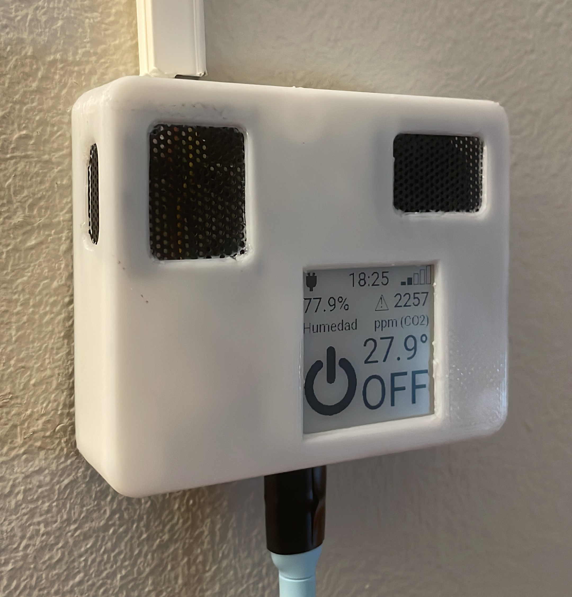

# ClimateController



This is my attempt at creating a climate controller for my IOT platform. 

This repository contains everything you need to build and customize your very own ESP8266-based climate controller. 

Whether you want to monitor temperature, humidity, CO2 levels, control a thermostat, manage appliances with a relay, or even handle IR-based air conditioning units, the ClimateController has you covered. 

This README will guide you through the repository's contents and how to get started with your climate controller project. Keep in mind this project was tailor made to cover my needs, so it will most likely need some adaptations for your use case. Feel free to ask me anything you may need about the project.

## Contents

This repository is organized into three main folders, each serving a unique purpose for your climate controller project:

### 1. Electronics

The "electronics" folder contains all the hardware-related materials you'll need:

- **Schematic**: Find the schematic diagram that outlines the electrical connections and components used in the climate controller.

- **PCB Design**: Get the PCB (Printed Circuit Board) design files to manufacture your own climate controller board. You can customize it to suit your needs or use the provided design.

- **KiCad Project**: The KiCad project files are available for further customization and refinement of the PCB design.

### 2. External Case

In the "external_case" folder, you'll find everything related to the physical housing of your climate controller:

- **Fusion360 Project**: Access the Fusion360 project, which contains the 3D model of the external case. You can modify and personalize the design to your liking.

- **Pregenerated Case Designs**: I've included pregenerated presets in .3mf format for 3D printing the external case. Use these presets if you don't have access to Fusion360.

### 3. Firmware

The "firmware" directory contains:

- **Example YAML File**: Use the provided YAML file as a starting point for programming your climate controller with ESPHome. You can adapt and expand upon this file to tailor the device's behavior to your needs.

## Device Features

The ClimateController is highly customizable and can be configured to suit your unique requirements. Here are some of the device's capabilities:

- **Temperature and Humidity Readings**: Monitor environmental temperature and humidity levels.

- **CO2 Readings**: Measure and track carbon dioxide levels in your surroundings.

- **Thermostat Control**: Control a thermostat or other appliances using a relay. This feature enables you to manage heating or cooling systems and other devices with ease.

- **IR-Based Air Conditioner Control**: Remotely manage IR-based air conditioning units for optimal climate control.

- **Display Options**: Choose between an OLED or E-INK display, offering flexibility for your preferred user interface.

## Getting Started

To begin your ClimateController project, follow these steps:

1. Clone this repository to your local machine using Git:
   ```
   git clone git@github.com:Pablo-Ortiz-Lopez/ClimateController.git
   ```

2. Explore the relevant folders to access the hardware and firmware resources.

3. Customize the PCB design, 3D case model, and firmware according to your project requirements.

4. Manufacture the PCB and 3D print the external case.

5. Load and customize the provided yml file into ESPHome, and then load it into the device. If you don't already have an ESPHome environment, I recommend looking into my [HomePanel](https://github.com/Pablo-Ortiz-Lopez/HomePanel) project.

6. Assemble the components and enjoy your personalized climate controller.

## Contributing

If you have improvements, bug fixes, or new features to contribute to the ClimateController project, feel free to create a pull request. I will welcome your contributions and ideas to make this project even better.